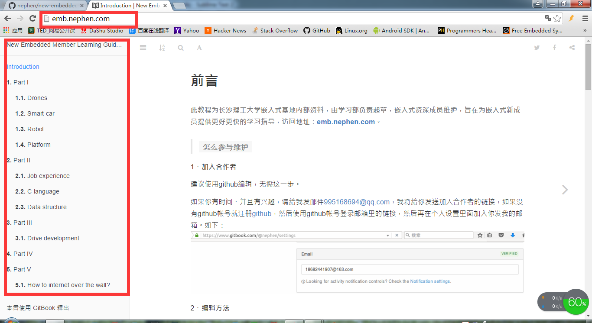
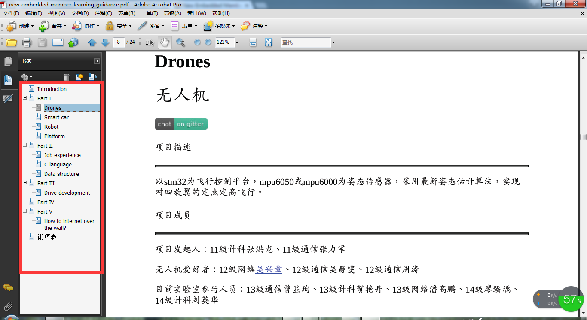
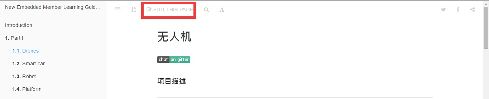
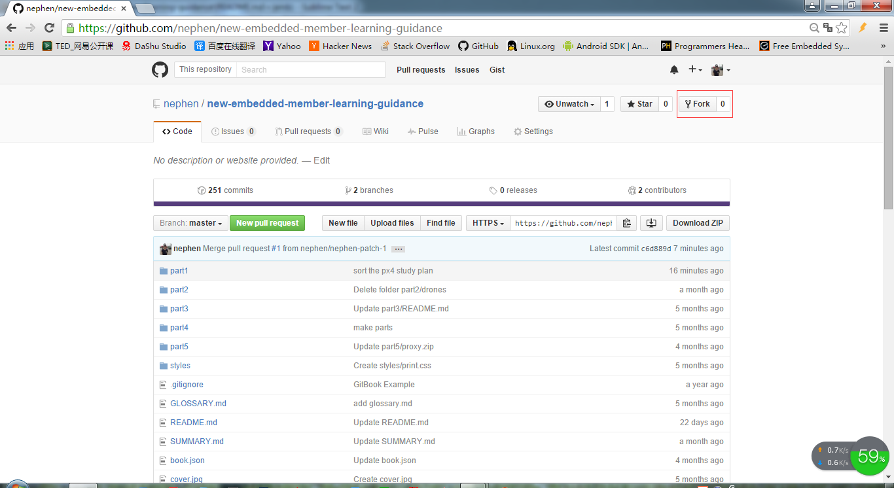

前言
=======

一直实验室就有一个管理漏洞，以前做过的项目找不到地方了，要么就是握在某几个人的手里别人不知道，甚至自己的项目有时候也找不到地方了，而上传实验室公共百度云盘的资料没有文字说明，多了的时候也很难找，或者有些人不方便登录和上传实验室公共百度云盘，导致后面接手或学习的人又得重新开始，在这个情况下，此教程诞生了。   
######该教程为长沙理工大学嵌入式基地内部资料，由学习部负责起草，嵌入式正式成员维护，通过整理实验室零散的项目文档资料到一起，为嵌入式新成员提供更好更快的学习指导，解决大家找资料难，学习找不到方向的问题。

>访问地址：[emb.nephen.com](http://emb.nephen.com/)    
>下载地址：[gitbook地址](https://www.gitbook.com/download/pdf/book/nephen/new-embedded-member-learning-guidance)



由于gitbook访问慢的原因，会定期生成pdf书本，大家从github里面按照如下方式下载[pdf书本](https://github.com/nephen/new-embedded-member-learning-guidance/blob/master/pdf/new-embedded-member-learning-guidance.pdf)即可。


书本展示如下



##怎么参与维护

1、**加入合作者（不推荐）**

建议使用github编辑，无需这一步。

如果你有时间、并且有兴趣，请给我发邮件<a href=mailto:995168694@qq.com>995168694@qq.com</a>，我将给你发送加入合作者的链接，如果没有github帐号就注册[github](https://github.com/login)，然后使用github帐号登录邮箱里的链接，然后再在个人设置里面加入你发我的邮箱。如下：


2、**编辑方法**

- *github编辑（推荐方法）*

	这种方法是采用更改github的形式来更改gitbook，**无需上面的加入合作者**，因为该gitbook文章已经与github连接起来，只要更改了被连接的github就可以更新gitbook文章，而且目前gitbook登录反应慢，所以建议采用这种更改github的方式。这里分为两种方式，依个人的习惯而选择吧。

	1. **网页端编辑**（推荐方法：非常简单，只需三步就可以完成你的贡献）

	    - 找到入口：浏览在线页面时编辑本页，这样，看到不妥的地方可以立马修改，如下图

		    

		    或者也可以打开[网页端](https://github.com/nephen/new-embedded-member-learning-guidance)进入要进行编辑的文件，如下图

		    ，

	    - 开始编辑：进入编辑页面后，对文件进行修改，会出现如下图问题

			

			按照提示，点击`Fork this repository and propose chanes`，进入即可编辑，如下图

			
	    - 提交贡献：首先提名文件更改，如下图

	    	 

	    	检查是否与原有版本有冲突，如果有，解决冲突再提交，没有则提交，如下图

	    	

	    	

	    	剩下来就是版主的事了，如果没有太大的问题，版主就可以合并分支了，到这你的对本文档的贡献就完成了。

	2. 本地编辑（git高级用户推荐）

		相对于网页端编辑，本地编辑只是编辑在本地，后期的提交分支还是得在网页端进行，不过在此之前你得fork本项目到你的仓库。

		

		然后进行如下操作
		
		```sh
		#下载你的项目到本地
		git clone https://github.com/your_github_username/new-embedded-member-learning-guidance.git

		#进入文件夹进行编辑即可，完成后如下操作

		git add .
		#这里可以看到你的更改状况

		git status
		#添加你的更改备注，让别人知道你干了什么

		git commit -m "your comment"
		#提交更改

		git pull https://github.com/nephen/new-embedded-member-learning-guidance.git master
		#检查是否与nephen云端产生冲突，如果有，解决冲突后重新git commit -m "your comment"

		git push origin master
		#推送到个人云端
		```
		到这里为止，还只对你自己的仓库进行了修改，你需要`new pull request`提交分支到nephen的仓库，如下图，可以看出，如果只是少量的更改，建议使用网页端编辑。

		

- *gitbook网页端编辑（不推荐）*

    如果你没有安装任何环境，你可以在[网页](https://www.gitbook.com/book/nephen/new-embedded-member-learning-guidance/details)上进行编辑，由于gitbook访问慢，不建议这种方法。

##参考资料

1. 关于gitbook，可查看[www.gitbook.com](https://www.gitbook.com)。

2. gitbook的官方使用，可查看[help.gitbook.com](https://help.gitbook.com/)。