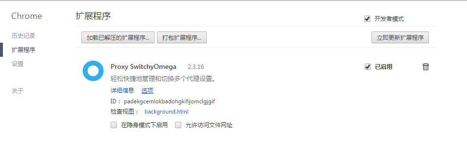
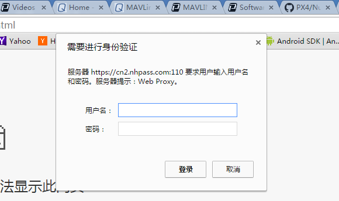
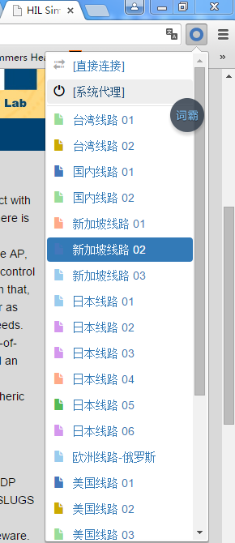

# How to internet over the wall?

####**注意**:`这篇文章仅做一个参考，由于一个帐号只能一个地方使用，请自行购买帐号，或者采用其他方式翻墙上网。`

1、下载[proxy.zip](../part5/proxy.zip)并解压，用`谷歌浏览器`打开设置，点击`扩展程序`，启用`开发者模式`，将解压后的`插件.crx`文件拖至谷歌界面，然后按照提示操作，导入`线路.bak`文件。About [more...](http://update.dfcqd.com/)

完成效果如图：

2、成功后登录即可

帐号：*120361744@qq.com*
密码：~~123456~~

登录界面：

3、完成后如下：

<a href="proxy.zip">下载</a>